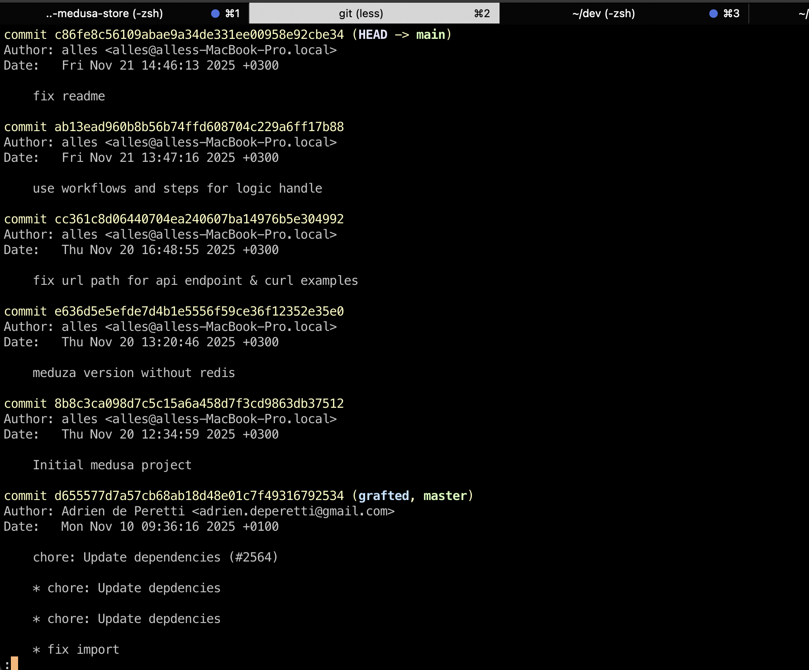

# Init project

mv .env.template .env // for test purpose show some secrets (not the best practice)
npm i // install dependencies

npm run docker:up // run docker

docker compose logs -f // to see logs

npm run docker:down // stop docker


Use your {your_publishable_api_key} from admin panel instead

my example: pk_e5ac14e5fb0ee1b9f0af8d1cd2ffed632aece2243e5cb6c7d876d6860c7b097b
```
curl 'http://localhost:9000/store/currency/convert?amount=200&from=USD&to=EUR' \
-H 'x-publishable-api-key: pk_e5ac14e5fb0ee1b9f0af8d1cd2ffed632aece2243e5cb6c7d876d6860c7b097b'
{"message":"173.16"}
```

# Endpoint curl examples

```
curl 'http://localhost:9000/store/currency/convert?amount=200&from=USD&to=EUR' \
-H 'x-publishable-api-key: {your_publishable_api_key}'
{"message":"173.16"}
```

```
curl 'http://localhost:9000/store/currency/convert?amount=100&from=USD&to=EUR' \
-H 'x-publishable-api-key: {your_publishable_api_key}'
{"message":"86.58"}
```

```
curl 'http://localhost:9000/store/currency/convert?amount=100&to=EUR' \
-H 'x-publishable-api-key: {your_publishable_api_key}'
{"message":"Initial country code not found or have invalid format"}
```

```
curl 'http://localhost:9000/store/currency/convert?amount=100&from=USD&to=' \
-H 'x-publishable-api-key: {your_publishable_api_key}'
{"message":"Result country code not defined or have invalid format"}
```

```
curl 'http://localhost:9000/store/currency/convert?amount=10a&from=USD&to=EUR' \
-H 'x-publishable-api-key: {your_publishable_api_key}'
{"message":"Initial amount not defined or not valid"}
```

External api not accessible - for example no network
```
curl 'http://localhost:9000/store/currency/convert?amount=100&from=GBP&to=USD' \
-H 'x-publishable-api-key: {your_publishable_api_key}'
{"message":"Something unexpected with convert workflow happened."}
```


Old git history (пришлось реинициализировать гит всвязи с ошибкой)
 
